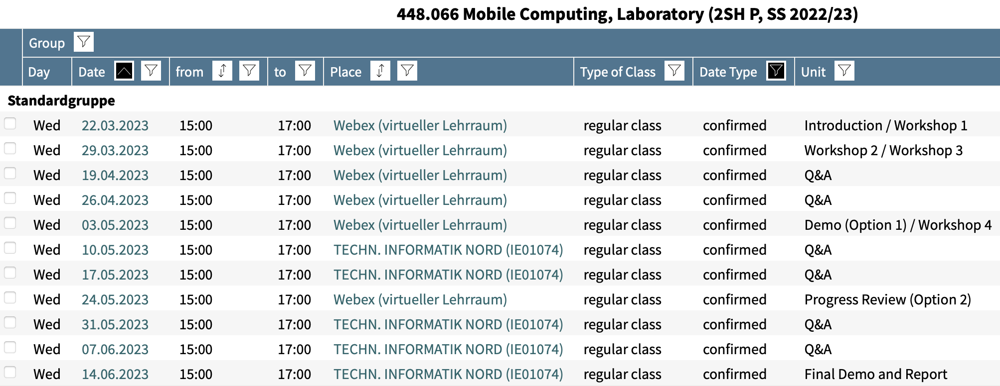
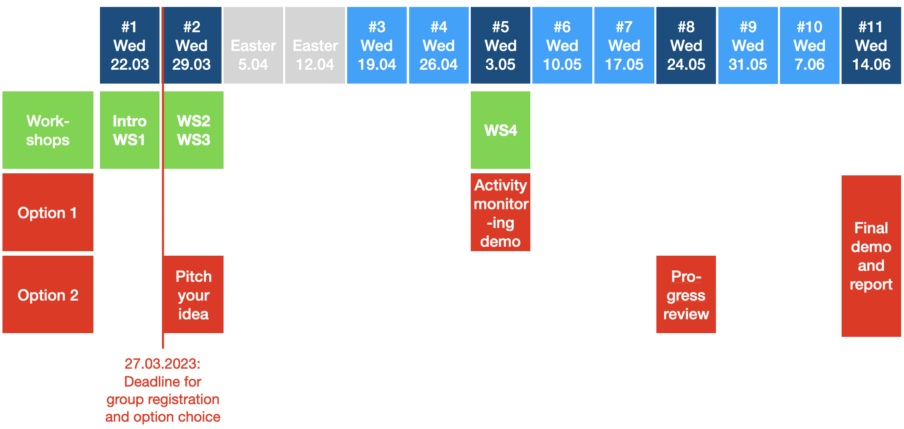

# 2022-03-23 Course Organization

## Basic Information
 
*   TUG Online: [Mobile Computing Lab (MCL), SS'22](https://online.tugraz.at/tug_online/wbLv.wbShowLVDetail?pStpSpNr=256443)
*   Instructor: [Olga Saukh](http://www.olgasaukh.com) ([TUG business card](https://online.tugraz.at/tug_online/visitenkarte.show_vcard?pPersonenGruppe=3&pPersonenId=BC91EB43629EBA38"))
*   TA: Peter Prodinger (peter.prodinger at student.tugraz.at)
*   [MCL course materials on GitHub](https://github.com/osaukh/mobile_computing_lab)

MCL starts on __Wed, 23.03.2022 at 3pm__ over Webex. Access details can be found under "Announcements" in the TeachCenter.

Join the __MCL Slack channel__ to connect to other students enrolled in the class. Access details can be found under "Announcements" in the TeachCenter.

## Content

The course provides an introduction to the current research trends in the area of mobile computing. The course will be based on a programming project, where students will form groups of 1-2 students to develop a smartphone app for Android (iOS is also fine). There is no disadvantage of implementing a project alone! 

To program a smartphone app, a developer needs to be familiar with:
1. Sensors and signals a smartphone can gather,
2. Data science and machine learning tools necessary to process sensor data, and
3. How to run sensor data processing algorithms and models on a smartphone.

This course will provide a solid background for the above points. During the workshops we will get familiar with the state-of-the-art in this emerging field. We will look into a few technologies and papers to understand how algorithms, signal processing, and machine learning tools are used to develop some exciting applications. The students will then use these basic tools to develop their own apps.
    

## Workshops

Workshops will help you to get started with the topics:
*   [Workshop 1 -- Sensors and signals: Android, sensors, activity recognition](2021-03-17__WS1_0__Sensors_and_Signals.ipynb)
*   [Workshop 2 -- Speech processing in mobile applications](2021-03-24__WS2_0__Speech_Processing.ipynb)
*   [Workshop 3 -- TensorFlow and TF Lite: Machine learning on mobile devices](2021-03-24__WS3_0__TensorFlow.ipynb)
*   [Workshop 4 -- Activity monitoring and transfer learning](WS04__OnDevice_TransferLearning.md)

Workshops / discussions / progress reviews / demos: __3-5pm on every scheduled occasion__ over WebEx. Code troubleshooting: use __Slack for asking questions__. Attend in-person Q&A sessions and ask Peter for help or send him an email (peter.prodinger at student.tugraz.at). Last resort: send an email to Olga (saukh at tugraz.at) and schedule a separate appointment.

## Schedule

## Prerequisites

The course is for new and experienced developers who already have Java programming experience and now want to learn how to build powerful Android apps.

## Teams

*   You will develop Android projects in groups of 1-2 students.
*   Make sure each group owns at least one smartphone running Android (or iOS and a MacBook). __If you have no Android phone contact Olga__.

In SS'21 due to COVID-19 the students are strongly encouraged to work on their projects independently. If you do decide to team up with someone, please consider remote collaboration tools and split the workload reasonably.

## Project Options

The course is based on a programming project. Two options are available:

#### Option 1: Activity monitoring and tranfer learning
The project is for beginners and consists of two parts: First, you will read sensor data provided by your phone (e.g., acceleration values) and use different algorithms (e.g., kNN) to detect the type of activity (e.g., jogging, walking, sitting, standing) you are currently doing. In the second part of the project, you will have to change the location of your phone (e.g., hold it in your hand instead of in your pocket) and use transfer learning to adjust the model quickly on your device.
    

Expected path:
* 	Week 1-3: Activity monitoring (e.g., based on kNN)
* 	Week 4-7: Transfer learning
* 	Week 8: GUI
* 	Week 9: Polish your code, measure performance, write final report
* 	Week 10: Demonstration and report

#### Option 2: Free project choice (the topic needs Olga's approval)

The project must involve sensors and non-trivial data processing on a mobile phone. Before you suggest a free choice project, please read related literature on the topic including scientific publications.

    
Expected path:
* 	Week 1: Define your project (read furiously) and agree with Olga
* 	Week 2: Pitch (problem statement, proposed solution, data)
* 	Week 2-7: Your own project
* 	Week 8: GUI
* 	Week 9: Polish, evaluate, write report
* 	Week 10: Demonstrations/Presentations

Check examples of <a href="http://www.olgasaukh.com/mcl.html">successfully completed MCL projects</a>.

#### Ideas for speech recognition

Perform speech processing __locally and in real time on your smartphone__. You may choose to detect and assess the following acoustic events:
   1. Word counting (see: <a href="https://www.researchgate.net/publication/263272600_A_Speech_System_for_Estimating_Daily_Word_Counts">A Speech System for Estimating Daily Word Counts</a>, INTERSPEECH 2014)
   2. Filler word detection (e.g., ehm, ahm, like, basically, eh, ah, see: <a href="https://www.youtube.com/watch?v=MNrD-6W3GkI">English Filler Words</a>)
   3. Detecting speaker's mood in different blocks of a talk (see <a href="https://zenodo.org/record/1188976#.Xm5acS3Mz_Q">RAVDESS data set</a>)

#### Ideas for image processing

You can build on existing pre-trained models for object detection broadly available online. Some potentially interesting directions to think about:
   1. Deriving social distance from camera images: [Machine learning could check if you’re social distancing properly at work](https://www.technologyreview.com/2020/04/17/1000092/ai-machine-learning-watches-social-distancing-at-work)
   
#### Where to start looking for own project ideas?
Scientific papers:
   * In Google scholar (<a href="http://scholar.google.com">scholar.google.com</a>) type "smartphone TOPIC".
   * The following conferences have some cool papers in the area: Mobisys, Mobicom, Sensys, IPSN, Percom, Ubicomp. In Google, type: "CONFERENCE_NAME YEAR", for example: “Mobisys 2020”, then go to the “Program” tab in that webpage.  
   * To expand on an area that you find interesting, follow the citations in papers (past) and the links that cite these papers (future).

Apps:
   * Reverse engineer an app that you like. 
   * Think of new apps. For example: real-time pub monitoring in Graz, real-time room reservation and tracking, monitor biking paths, social distance measurements with UWB or BLE, etc.

## Tools

### GitHub, GitLab, Google Colab
* 	Version control your code on <a href="https://github.com">GitHub</a> or <a href="https://about.gitlab.com">GitLab</a>. 
* 	Git tutorials: <a href="https://guides.github.com">GitHub Guides</a>, <a href="https://education.github.com/git-cheat-sheet-education.pdf">Git Cheat Sheet</a>, Oreilly's Book <a href="https://www.foo.be/cours/dess-20122013/b/OReilly%20Version%20Control%20with%20GIT.pdf">"Version Control with Git"</a>, game: <a href="https://learngitbranching.js.org">Learn Git Branching</a>.
* 	[Google Colab](https://colab.research.google.com) to run iPython notebooks and collaborate on the code. Will be used later in this course.

### Assistance
* 	Olga is available in the virtual classroom 3-5pm every scheduled appointment.
* 	Peter (peter.prodinger at student.tugraz.at) will help you to fix coding issues. Approach him on Slack or email him if you need help.
* 	It's easier to help if you use GitHub / GitLab / Google Colab and we can access your code!

### Hints
* 	Learning mobile development is not difficult, but do not underestimate the required time and effort!
* 	Do not wait until the last minute to start working on the project!

__Previous years' statistics__: Activity recognition app takes a team of 2 people (with some Android programming experience) 4 days to complete (full time). Transfer learning will probably take the same team 7 days to complete (full time).

## Progress / Demos / Reports 
* 	Intermediate progress meetings are there to make sure you are well on track. See instructions:
    * 	<a href="Progress_Reviews.md">2021-05-05 Progress Review</a> 
    * 	<a href="Progress_Reviews.md">2021-06-02 Progress Review</a>
* 	At the end of the course you will be asked to 
    * 	Submit your report as PDF
    *  	Share with Olga the link to your GitHub / GitLab repository
    * 	Present and demonstrate your app in action
* 	See <a href="Final_Demo_and_Report.md">2021-06-23 Final Demo and Report</a>

## Grading
*   Your final grade is based on the following grading scheme:
    - 20 points -- Novelty, your ideas, attention to detail, code clarity
    - 60 points -- Working demo and quality of the obtained performance results
    - 20 points -- Quality of the report (structure, readability)

* Grading scheme:
    - &#8805; 90 --> 1 (excellent)
    - &#8805; 78 --> 2 (good)
    - &#8805; 65 --> 3 (satisfactory)
    - &#8805; 50 --> 4 (sufficient)
    - < 50 --> 5 (insufficient)

There will be presents for the best projects!

In case of on-site classroom suspension the presents will be sent to you by post.
