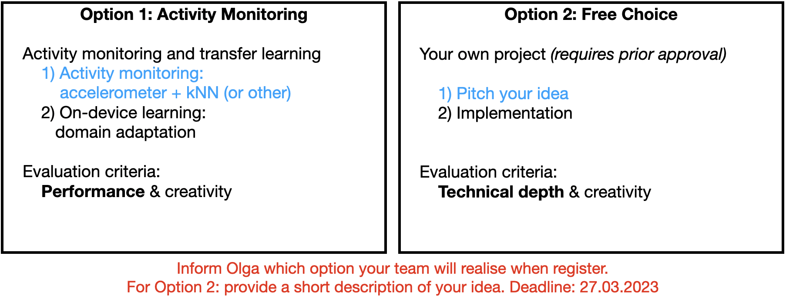

# Workshop 1: Sensors and Signals

### 1. Install Android Studio on Your Laptop

Follow instructions for your operating system:
* [Install Android Studio](https://developer.android.com/studio/install.html)

### 2. Android Hello World App

Goal: Make sure you have a working system, create your first Android app and run it in an emulator and on your phone.

__Follow instructions:__ 
* [Build Your First Android App](https://developer.android.com/training/basics/firstapp)

In case you have troubles activating your phone or running an app on your phone, please check the following:

* Unauthorised access: [A fix available on StackOverflow](https://stackoverflow.com/questions/30258272/adb-rsa-authorization-key-dialog-will-not-open)
* Settings -> Developer Options -> Networking -> USB Configuration = MTP (or make sure File Transfer is enabled)

### 3. Sensors and Signals

Goal: Learn about the Android sensor framework, which is used to find the available sensors on a device and retrieve data from those sensors.

<table><tr>
<td></td>
<td></td>
</tr>
</table>

__Follow instructions:__
* Read: [Sensors overview](https://developer.android.com/guide/topics/sensors/sensors_overview)
* Follow the steps: [3.1: Getting sensor data (do both Task 1 and Task 2)](https://developer.android.com/codelabs/advanced-android-training-sensor-data#0)
* __Exercise (Task 1):__ Number the sensors in the SensorSurvey list on the screen 
* __Exercise (Task 2):__ Add and display accelerometer values

## Your Task

* Option 1 --> [Cookbook: Activity Monitoring with kNN](https://github.com/osaukh/mobile_computing_lab/blob/master/Cookbook__ActivityMonitoring_with_kNN.md)
