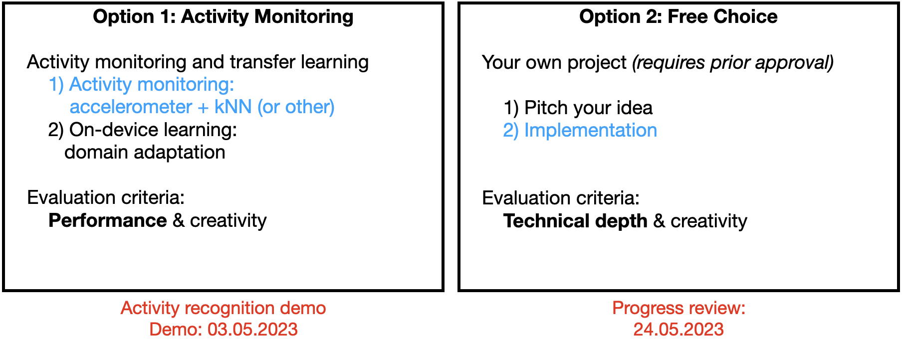

# Workshop 1: Sensors and Signals


### 1. Install Android Studio on Your Laptop

Follow instructions for your operating system:
* [Install Android Studio](https://developer.android.com/studio/install.html)

### 2. Android Hello World App

Goal: Make sure you have a working system, create your first Android app and run it in an emulator and on your phone.


__Follow instructions:__ 
* [Build Your First Android App](https://developer.android.com/training/basics/firstapp)

In case you have troubles activating your phone or running an app on your phone, please check the following:

* Unauthorised access: [A fix available on StackOverflow](https://stackoverflow.com/questions/30258272/adb-rsa-authorization-key-dialog-will-not-open)
* Settings -> Developer Options -> Networking -> USB Configuration = MTP (or make sure File Transfer is enabled)

### 3. Sensors and Signals

Goal: Learn about the Android sensor framework, which is used to find the available sensors on a device and retrieve data from those sensors.

<table><tr>
<td></td>
<td></td>
</tr>
</table>

__Follow instructions:__
* Read: [Sensors overview](https://developer.android.com/guide/topics/sensors/sensors_overview)
* Follow the steps: [3.1: Getting sensor data (do both Task 1 and Task 2)](https://developer.android.com/codelabs/advanced-android-training-sensor-data#0)


### 4. Activity Monitoring


#### Step 1: Raw signal

* Key sensors for our app (... and many more other applications):
	* __Accelerometers__ convert acceleration into an electrical signal
	* __Gyroscopes__ measure angular rate (how quickly an object turns)
	* __Compass__ sensor detect the magnetic field of the Earth
	* Radio transceivers detect surrounding access points and their __signal strength (RSS)__
* Energy consumption matters
	* For example, on HP iPAQ hw6965: GPS 620 mW, Microphone 225 mW, Accelerometer 2 mW
	* __Always solve the problem using as little energy as possible__
* Most smartphones have 3-axis accelerometers. Accelerometers can provide a lot of information.
	* Activity monitoring 


Source: Paper [Activity Recognition from User-Annotated Acceleration Data](http://web.media.mit.edu/~intille/papers-files/BaoIntille04.pdf), Pervasive 2004


#### Step 2: Feature extraction (art and science)

* How would you describe a signal statistically?
* Example:
	* Choose a window size (20 samples, 500 ms)
	* Select features (mean, max min, variance, Fourier transforms, autocorrelation, ...)


#### Step 3: Classification method (science)

* __Exploration:__ Get some features and plot them. There going to be an overlap depending on the window's size.


* __k-Nearest Neighbors algorithm (kNN)__ is a top-10 machine learning tool! The output is a class membership. An object is classified by a majority vote of its neighbors, with the object being assigned to the class most common among its k nearest neighbors (k is a positive integer, typically small). If k = 1, then the object is simply assigned to the class of that single nearest neighbor.


The test sample (green circle) should be classified either to the first class of blue squares or to the second class of red triangles. If k = 3 (solid line circle) it is assigned to the second class because there are 2 triangles and only 1 square inside the inner circle. If k = 5 (dashed line circle) it is assigned to the first class (3 squares vs. 2 triangles inside the outer circle).

Source: [Wikipedia](http://en.wikipedia.org/wiki/K-nearest_neighbor_algorithm)

* __Decisions to be made:__
	
_How large is K?_
* Odd number
*  

_What is the best distance measure?_
		
__Euclidean:__ is the "ordinary" (i.e. straight-line) distance between two points in Euclidean space.

=\sqrt{\sum(w_i-v_i)^2})

__Manhattan:__ is a city block distance, taxicab metric is defined as the sum of the lengths of the projections of the line segment between the points onto the coordinate axes.

=\sum|w_i-v_i|)


__Chebyshev (Chessboard):__ is a distance measure where all 8 adjacent cells from the given point can be reached by one unit i.e diagonal move is valid. It is also known as chessboard distance, since in the game of chess the minimum number of moves needed by a king to go from one square on a chessboard to another equals the Chebyshev distance between the centers of the squares.

=\max|w_i-v_i|)


Source: [Euclidean vs Chebyshev vs Manhattan Distance?](http://www.isumitjha.com/2017/12/chebyshev-vs-euclidean-vs-manhattan.html)

# Your Task: Activity Monitoring (Option 1)



### Cookbook

#### 1. Read accelerometer data and display data on the screen

* Implement the interface `SensorEventListener`:
```java
public class MainActivity extends AppCompatActivity implements SensorEventListener {
```

* Declare variables for `SensorManager` and `accelerometer`:
```java
private SensorManager sm;
private Sensor accelerometer;
```

* Instantiate them in `OnCreate` method:
```java
@Override
protected void onCreate(Bundle savedInstanceState) {
        ...
    sm = (SensorManager)getSystemService(SENSOR_SERVICE);
    accelerometer = sm.getDefaultSensor(Sensor.TYPE_ACCELEROMETER);
        ...

    sm.registerListener(this, accelerometer, SensorManager.SENSOR_DELAY_NORMAL);
}
```

* Capture sensor values in `onSensorChanged` method:
```java
@Override
public void onSensorChanged(SensorEvent event) {
    double x, y, z;
    x = event.values[0];
    y = event.values[1];
    z = event.values[2];

    //Store data in memory, file, or in other data structure
    addDataToProcess (x, y, z); 
}

```

* Call your function to recognize activity at suitable times:
```java
public ActivityType recognizeActivity () {
    // ActivityType is an enum {NONE, SIT, WALK, RUN, ...};

    // Fill in with your algorithm
}
```

#### Step 2: Write accelerometer data to a file

* File I/O - Reading:
```java
import java.io.DataInputStream;
import java.io.File;
import java.io.FileInputStream;
import java.io.FileNotFoundException;
import java.io.IOException;

//Reading from a file
DataInputStream fInpStream = null;

try {
    fInpStream = new DataInputStream (new FileInputStream("<path>"));
    while(fInpStream.available() > 0) {
        double d = fInpStream.readDouble ();
        ...
    }
}
catch (FileNotFoundException e) {
    e.printStackTrace();
    ...
}
```

* File I/O - Writing:
```java
import java.io.DataOutputStream;
import java.io.File;
import java.io.FileNotFoundException;
import java.io.FileOutputStream;
import java.io.IOException;

//Writing to a file
DataOutputStream fOutStream = null;

try {
    fOutStream = new DataOutputStream (new FileOutputStream("<path>"));
    double d = 0.02;
    fOutStream.writeDouble(d);
    fOutStream.flush();
} catch (FileNotFoundException e) {
    e.printStackTrace();
    ...
} catch (IOException e) {
    e.printStackTrace();
    ...
}
```
Also see: [App data and files](https://developer.android.com/guide/topics/data)

You need to make sure that the application has permission to read and write data to the users SD card, so open up the `AndroidManifest.xml` and add the following permissions:
```xml
<uses-permission android:name="android.permission.WRITE_INTERNAL_STORAGE"/>
<uses-permission android:name="android.permission.READ_INTERNAL_STORAGE"/>
```
or
```xml
<uses-permission android:name="android.permission.WRITE_EXTERNAL_STORAGE"/>
<uses-permission android:name="android.permission.READ_EXTERNAL_STORAGE"/>
```

#### Step 3: Copy file from step 3) to your laptop

#### Step 4: Do kNN analysis offline first

You can use any programming language you want! I highly recommend to use Python. You can use a third-party kNN implementation in this step.
* Divide data in two parts for training and testing
* Select a window size
* Select feature vectors from training set
* Perform classification with testing set

#### Step 5: Program kNN in your smartphone and display classification on the screen


(This is just an example)

__Important:__ Please do NOT use Google Play Services Activity Recognition API but you can use it to compare your own app performance.

## References

* Research papers on activity monitoring
	* [LIMU-BERT: Unleashing the Potential of Unlabeled Data for IMU Sensing Applications](https://tanrui.github.io/pub/LIMU_BERT.pdf), 2021
	* [SelfHAR: Improving Human Activity Recognition through Self-training with Unlabeled Data](https://arxiv.org/abs/2102.06073), 2021
