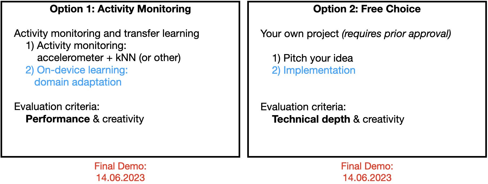

# Workshop 4: On-device Transfer Learning

### Activity Monitoring: What should you have by now?

If you decided to go for Option 1, you should have a mobile app providing the following functionality:
*    Gathering sensor data (from accelerometer, gyroscope, etc.)
*    Extracting features from this data
*    Using kNN (or another method) to attribute the feature vector to the right activity. The model parameters are determined offline using your own data set.

Your app should be fairly accurate when tested with a smartphone held and fixed in the same position on your body as when gathering training data. If you change the position (e.g., by rotating the phone or fixing it to your leg instead of your arm) your activitiy recognition may (and most probably will) fail because measured signal will look fairly different (see below). In this workshop you will learn how one can address the problem with __on-device transfer learning__. We will create a generic model and personalize it on the phone.

### Model Personalization by Transfer Learning

Transfer learning is inspired by the way human learners take advantage of their existing knowledge and skills: A human who knows how to read literature is more likely to succeed in reading scientific papers than a human who does not know how to read at all. In the context of supervised learning, transfer learning implies the ability to reuse the knowledge of the dependency structure between features and labels learned in one setting to improve the inference of the dependency structure in another setting.

Suppose that you want to get the best user experience possible by adjusting the model to users’ needs (specific position or way of carrying a smartphone, etc.). Sending user data to the cloud to train a model requires a lot of care to prevent potential privacy breaches. It's not always practical to send data to a central server for training---issues like power, data caps, and privacy can be problematic. However, training directly on device is a strong approach with many benefits: Privacy-sensitive data stays on the device so it saves bandwidth, and it works without an Internet connection.

Training can require a non-trivial number of data samples which is hard to get on-device. Training a deep network from scratch can take days on the cloud so it's not suitable on device. Instead of training a whole new model from scratch, we can retrain an already trained model to adapt to a similar problem through transfer learning.

Transfer learning involves using a pre-trained model for one “data-rich” task and retraining a part of its layers (typically the last ones) to solve another, “data-poor” task. This is usually done by re-training only the last few layers (the head) of a neural network. The remaining layers are frozen and not updated. This is how the knowledge learned by on a data-rich task is transfered. Below you can see how the head of a neural network on the left is replaced by a new head, while the bottom part of the network remains unchanged.

With transfer learning we can train personalized models __on-device__ even with __limited training data and computational resources__ while __preserving user privacy__.

### Example: On-device Transfer Learning for Object Detection

This application example is taken from the TensorFlow Lite tutorial:
<ul><li>
<a href="https://github.com/tensorflow/examples/tree/master/lite/examples/model_personalization">TensorFlow Lite Example On-device Model Personalization</a>
</li></ul>

The example includes an Android pplication that learns to classify camera images in real-time. The training is performed on-device by taking sample photos of different target classes.

The app uses transfer learning on a quantized MobileNetV2 model pre-trained on ImageNet with the last few layers replaced by a trainable softmax classifier. You can train the last layers to recognize any four new classes. Accuracy depends on how “hard” the classes are to capture. For many objects just tens of samples can be enough to achieve good results. Compare this to ImageNet, which has 1.3 million samples!

This example includes a set of reusable tools that help to create and use your own personalizable models. The example includes three distinct and isolated parts, each of them responsible for a single step in the transfer learning pipeline.

__Transfer Learning Converter__ (uses TF Lite Converter):

To generate a transfer learning model for your task, you need to pick two models that will form it:
* __Base model__ that is typically a deep neural network pre-trained on a generic data-rich task.
* __Head model__ that takes the features produced by the base model as inputs and learns from them to solve the target personalized task. This is typically a simpler network with a few fully-connected layers.

The model should be created with TensorFlow.

__On-device Android library__ (uses TF Lite Interpreter):

The transfer learning model produced by the transfer learning converter cannot be used directly with the TensorFlow Lite interpreter. An intermediate layer is required to handle the non-linear lifecycle of the model. This is done by the Android library that lives in a standalone Gradle module so it can be easily integrated into any Android application.

__Application:__

The Android application shows how to light-retrain a model (transfer learning) and do inference using that model.

<mark>__Exercise:__</mark> Prepare a model, run this app on your device and understand the source code:

<table>
  <td>
    
  </td>
  <td>
    <a target="_blank" href="https://github.com/osaukh/mobile_computing_lab/blob/master/code/ModelPersonalization/WS04_TransferLearning_Personalization.ipynb">
    
    View source on GitHub</a>
  </td>
</table>

*    [On-device Model Personalization](https://github.com/osaukh/mobile_computing_lab/blob/master/code/ModelPersonalization/)

***

# Your Task: Personalized Activity Monitoring with Transfer Learning

## Cookbook

#### Step 1: Base and head models

Similar to the above example, you will need to train a base model and prepare a head model. You can experiment with different base models and different datasets you use for model pretraining. 

Similar to your initial activity classification with kNN, your list of activities must be: (1) walking, (2) jogging, (3) jumping, (4) squatting, (5) sitting, (6) standing.

#### Step 2: Integrate transfer learning into your own app

Extend your own activity recognition app (which uses kNN or another method) to provide the following functionality:
* Continue using your kNN implementation
* Add inference using a generic model trained in step 1
* Use transfer learning to support data gathering, training and inference for the personalized model
* In the GUI show activity prediction using all three models

#### Step 3: Compare model performance

Compare the performance of the three models on your own test set collected for two locations / orientations of the phone. For example, once when holding the phone in your hand facing up and once in your pocket or attached to your arm or leg. The test set should be the same for all three models. Include the comparison and confusion matrices for each model in your report (see: [Final Demos and Report](https://github.com/osaukh/mobile_computing_lab/blob/master/Final_Demo_and_Report.md)).

#### Step 4: Final demo

Show all models in action in the final demo! The final demo will be in person, but please also send Olga a video of the demo before the appointment.

## References

*    TensorFlow Blog: [Example on-device model personalization with TensorFlow Lite](https://blog.tensorflow.org/2019/12/example-on-device-model-personalization.html), 2019
*    Medium: [Transfer Learning with keras](https://medium.com/analytics-vidhya/transfer-learning-with-keras-9a1b3253211c), 2019
* 	 Medium: [Human Activity Recognition (HAR) Tutorial with Keras and Core ML (Part 1)](https://towardsdatascience.com/human-activity-recognition-har-tutorial-with-keras-and-core-ml-part-1-8c05e365dfa0)
*    GitHub: [Human Activity Recognition Tutorial with Keras and CoreML (Part 1)](https://github.com/ni79ls/har-keras-coreml/blob/master/Human%20Activity%20Recognition%20with%20Keras%20and%20CoreML.ipynb)