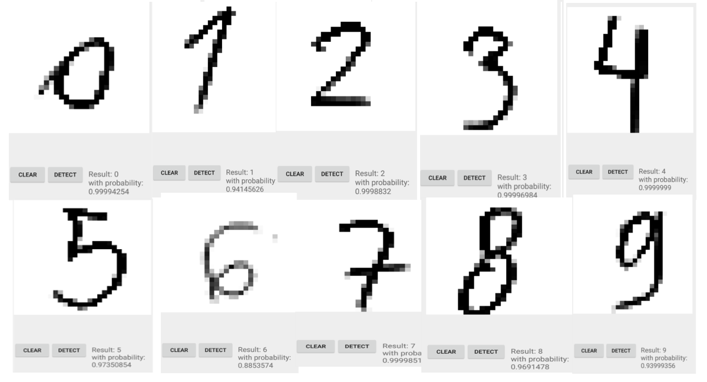

# HandWrittenDigits App

This app works with TensorFlow Lite and requires TensorFlow > 1.9.1. It is based on the implementation for older versions of TensorFlow [kindly provided and nicely explained here](https://github.com/llSourcell/A_Guide_to_Running_Tensorflow_Models_on_Android/tree/master/mnistandroid) and [here](https://github.com/miyosuda/TensorFlowAndroidMNIST). 

  

This app is part of the [Workshop TensorFlow, Mobile Computing Lab @ TU Graz](https://github.com/osaukh/mobile_computing_lab/blob/master/WS03__TensorFlow_and_TFLite.md)
