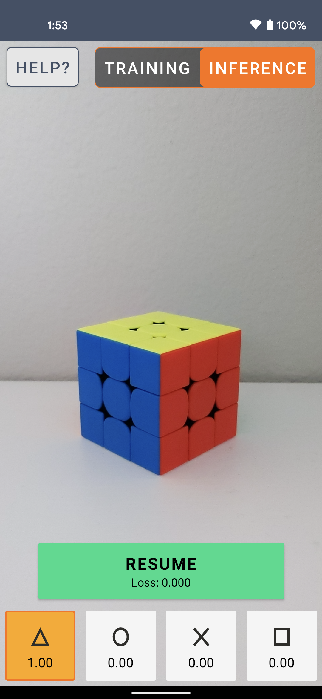

# On-device Model Personalization

This example illustrates a way of personalizing a TFLite model on-device without sending any data to the server. It builds on top of existing TFLite functionality, and can be adapted for various tasks and models.

Original path: [https://github.com/tensorflow/examples/tree/master/lite/examples/model_personalization](https://github.com/tensorflow/examples/tree/master/lite/examples/model_personalization)

  

This project is part of the [Workshop on Transfer Learning, Mobile Computing Lab @ TU Graz](https://github.com/osaukh/mobile_computing_lab/blob/master/WS04__OnDevice_TransferLearning.md)

